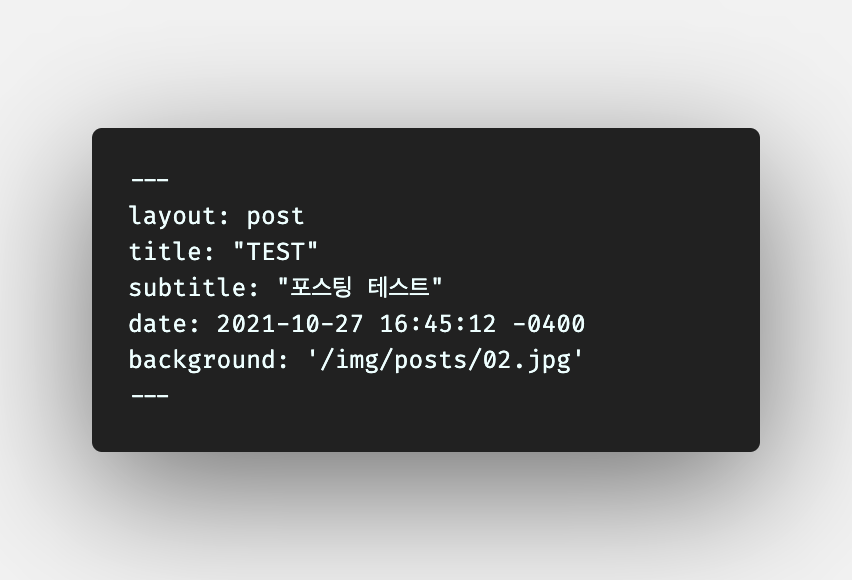

## **Markdown 포스팅**

이제부터 Markdown으로 포스팅을 할 수 있게 됐다!   

정확히는, Markdown으로 포스팅 할 수 있는 방법을 알게되었다. 여태껏 Markdown을 이용한 포스팅을 시도하지 못했던 이유는 사용중인 블로그 템플릿의 글 작성 형식에 있었다.

 

위의 사진과 같이, 포스팅의 제목과 부제목 및 글 작성 날짜와 배경사진을 넣기 위해선 html문서의 맨 앞에 양식을 따라 입력할 필요가 있다. 그 아래로 \<!DOCTYPE html\>이나 \<head\>와 같은 html의 기본 태그도 갖추지 않은 채 \<p\>태그를 입력하면 바로바로 화면에 나타나는 구조이다. (*layout: post* 에 의해 style이나 head등을 불러오는 구조로 보여지는데, 정확히 어떠한 작동원리를 갖고 있는지는 아직 알 수 없었다.)

아직까진 '홈페이지의 몸뚱아리는 html이, 몸뚱아리의 구성요소를 꾸며주는건 css(style)가, 실시간 입력과 출력은 js(script)가' 라고만 알고 있는 내 지식으론 너무나도 생소한 구조였기에, Markdown 이전에 이 홈페이지를 다루는 것조차 난감했다.

하지만, 검색과 함께 해당 홈페이지와 vscode를 장시간 만져본 결과, 허탈할 정도로 쉽게 Markdown으로 포스팅 할 수 있는 방법을 알아낼 수 있었다.

---

## **vscode의 extension**

vscode에 깔려있던 extension은 테마와 관련된 extension나 prettier, live server정도였는데, 유튜브나 구글등을 통해 알아보니 Markdown in all이라는 extension이 있는 걸 알았다.

이 extension에는 다양한 기능이 있지만, 그 중 두가지 기능에 주목했는데, 하나는 vscode내 Markdown 미리보기 기능이었고, 나머지 하나는 mk파일로 쓰여진 글을 html로 변환해주는 기능이었다.

이 기능은 TIL2에서 사용했던 각종 사이트에서 제공하는 Markdown to html기능보다 더 강력했는데, html의 기본적인 선언이 들어가 있는 것은 물론, 폰트의 크기나 모양 등을 사용자가 직접 변경할 수 있도록 구성해놓았다.(물론 아직 건드릴 수는 없었다.)

여기서, Markdown in all을 사용해 만들어진 html파일 전체를 포스트용 레이아웃(상단 사진) 아래에 복사해 넣었더니, 황당하게도 아주 잘 작동했다.(전 포스트 'TEST')

다만, 오히려 더욱 불안이 따르는 면도 있다. 내가 완전히 잘못 알고있는게 아니라면 다른 html, css, js파일에서 선언된 내용이 어떤 방법을 통해 다른 html파일들에 연결되어 있는 것일텐데, \<!DOCTYPE html\>부터 시작한 모든 내용을 추가로 붙여넣기 해뒀다간 언젠가 충돌이 발생할지도 모르기 때문이다.

그래도, 당장은 문제없이 작동하는 것처럼 보이는데다 이 블로그를 관리하는 것 말고도 다른 목표가 있기 때문에, 당분간은 Markdown 포스팅과 관련된 내용은 조금 미뤄두기로 한다.

---

## **앞으로?**

TIL을 시작하며 정해둔 목표가 총 3개였다. 조금 이르지만 첫번째인 Markdown으로 포스팅 할 수 있는 환경 구축은 반쪽자리지만 달성했으니, 나머지 두 목표에 집중할 것이다. 

1. '나만의 아이디어로 홈페이지 만들기'는 최근 즐겨하고 있는 게임인 '로스트아크'와 관련해서 정보를 제공하는 홈페이지를 만들어보려 한다. 아직 확실한 아이디어가 나온 것은 아니지만 아마 python을 통해 크롤링 해온 정보들을 가공해서 유저들에게 제공하는 홈페이지가 되지 않을까 생각한다. 
2. '복잡한 홈페이지 카피본 만들기'는 아직 확실하게 정하지 못했다. SNS나 쇼핑몰 혹은 검색 엔진 중 하나를 고를 듯 하다.

